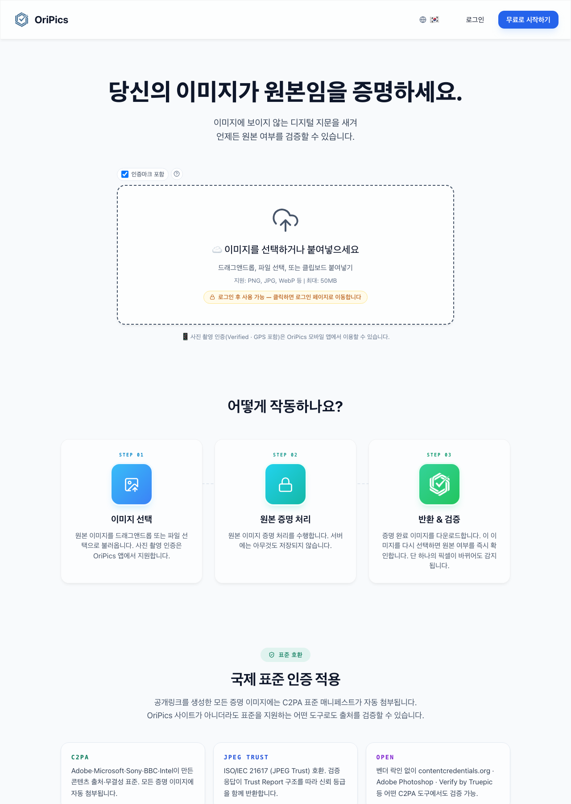
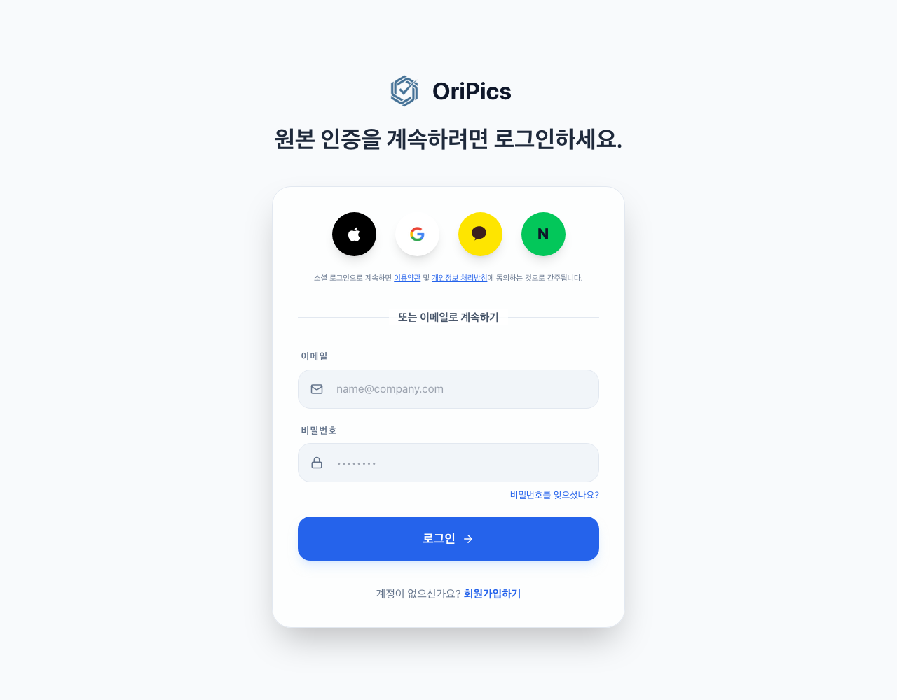
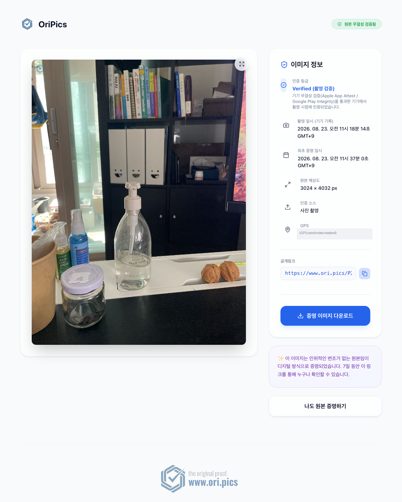

# OriPics 서비스 소개 자료

**네이버 로그인 검수 제출용** · 작성일: 2026-08-27 · 운영사: 산타하데스 주식회사 (사업자등록번호 444-88-02865)

- **서비스 URL**: https://www.ori.pics (운영 중 — 즉시 접속·이용 가능)
- **네이버 로그인 적용 화면**: https://www.ori.pics/ko/login (로그인) · https://www.ori.pics/ko/signup (회원가입)
- **업종/콘텐츠 유형**: 사진 원본 인증 SaaS (유틸리티 — 사용자가 자신의 사진이 촬영된 그대로의 원본임을 증명하고, 공개 링크로 제3자가 검증할 수 있는 서비스)

---

## 1. 서비스 개요

OriPics는 **"이 사진이 조작되지 않은 원본인가?"를 증명**하는 서비스입니다. AI 생성·보정 이미지가 늘면서 사고 증빙, 임대 퇴실 분쟁, 중고거래, 작품 도용 등 사진 한 장이 분쟁의 근거가 되는 순간에 원본성을 증명할 수단이 필요해졌습니다.

사용자가 사진을 인증하면 이미지 픽셀 안에 보이지 않는 디지털 서명(스테가노그래피)을 삽입하고 서버가 인증 시각을 서명합니다. 이후 픽셀이 하나라도 수정되면 판독에서 감지됩니다. 국제 표준 **C2PA**(Adobe·Microsoft·Sony 주도)의 적합성 인증(Conformant) 등재 제품입니다.

- 4월 검수 당시에는 개발 중이었으나, **현재는 정식 운영 중**입니다 (웹 서비스 오픈 + iOS/Android 앱 베타 테스트 진행 중).

## 2. 메뉴별 기능 및 화면

### 2-1. 홈 (https://www.ori.pics) — 원본 인증·판독

서비스의 핵심 화면입니다. 사용자가 이미지를 선택해 ①**원본 인증**(보이지 않는 서명 삽입 + 인증 이미지 다운로드/공개 링크 발행) 또는 ②**판독**(인증된 이미지인지, 수정되지 않았는지 확인)을 수행합니다. 하단에 작동 원리·요금·FAQ가 이어집니다.

### 2-2. 로그인 / 회원가입 — 네이버 로그인 적용 화면

이메일 가입과 소셜 로그인(Apple·Google·Kakao·**Naver**)을 제공합니다. 네이버 로그인은 **신규 회원 가입**과 **기존 회원 로그인** 두 용도로 사용되며, 네이버 인증 완료 시 별도의 비밀번호를 요구하지 않고 즉시 가입·로그인됩니다. 회원가입 화면에는 이용약관·개인정보 처리방침 동의 절차가 있습니다.

### 2-3. 공개 링크 뷰어 — 제3자 검증 화면

인증된 사진의 공개 링크를 열면 누구나(로그인 불필요) 원본 여부·인증 시각·해상도 등을 확인할 수 있습니다. 분쟁 상대방·보험사 등 제3자에게 원본임을 보여주는 화면입니다.

### 2-4. 프로필 (로그인 후)

계정 정보(이름·이메일·프로필 사진), 이용 현황(잔여 건수·플랜), 발행한 공개 링크 목록, 회원 탈퇴 기능을 제공합니다. *(로그인 후 화면 — 별도 첨부 캡처 참조)*

## 3. 네이버 로그인 제공 정보의 활용처

| 제공 정보 | 활용처 |
|---|---|
| **이메일 주소** | 회원 계정 식별·로그인, 중복 가입 방지 (프로필 화면에 표시) |
| **회원이름(별명)** | 서비스 내 표시 이름 (홈·프로필 화면의 인사말/계정명) |
| **프로필 사진** | 프로필 화면의 아바타 표시 |

네이버 로그인 가입 과정에서 **별도의 비밀번호나 추가 정보를 요구하지 않습니다.**

## 4. 이미지 데이터의 수집·보관·파기 정책

본 서비스가 다루는 이미지는 **사용자가 원본 인증을 위해 직접 선택·업로드한 본인의 사진**에 한정됩니다.

1. **수집**: 인증 처리(디지털 서명 계산)는 사용자의 기기(브라우저)에서 수행되며, 이미지는 서버로 전송되지 않습니다. 사용자가 **공개 링크 발행을 선택한 경우에만** 인증 처리된 결과 이미지가 클라우드 스토리지(암호화 전송·비공개 버킷)에 저장됩니다.
2. **보관**: 무료 플랜의 공개 링크 이미지는 **7일 후 자동 삭제**됩니다. 유료(Pro) 플랜은 구독 기간 동안 보관하며, 구독 종료 시 유예기간 후 삭제됩니다.
3. **파기**: 보관 기간 만료 시 자동 파기되며, 사용자가 공개 링크를 직접 삭제하거나 **회원 탈퇴 시 계정과 모든 이미지·데이터가 즉시 삭제**됩니다. 회원 탈퇴는 프로필 화면에서 언제든 가능합니다.
4. **판독(검증) 시**: 이미지가 서버로 전송되지 않으며, 기기에서 추출한 서명 정보만 확인합니다.
5. 상세 내용은 개인정보 처리방침에 고지되어 있습니다: **https://www.ori.pics/ko/privacy**

## 5. 문의

- 이메일: hi@ori.pics
- 운영사: 산타하데스 주식회사 (대표 손용석)
